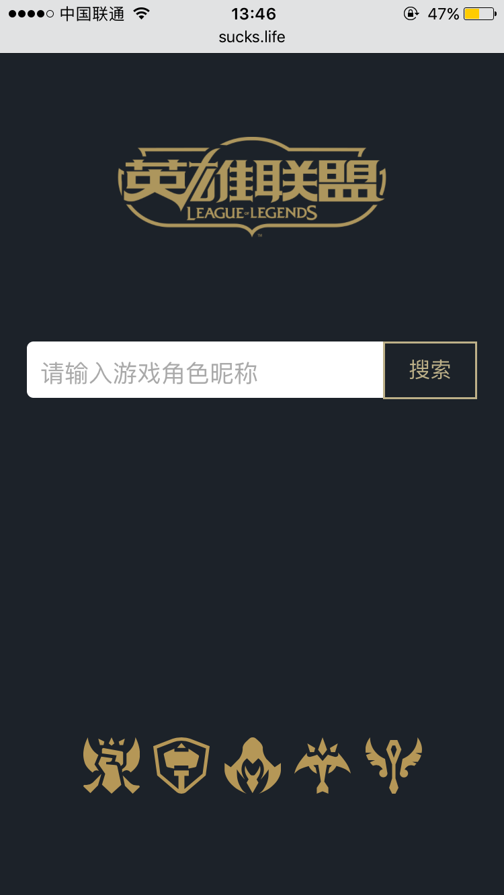
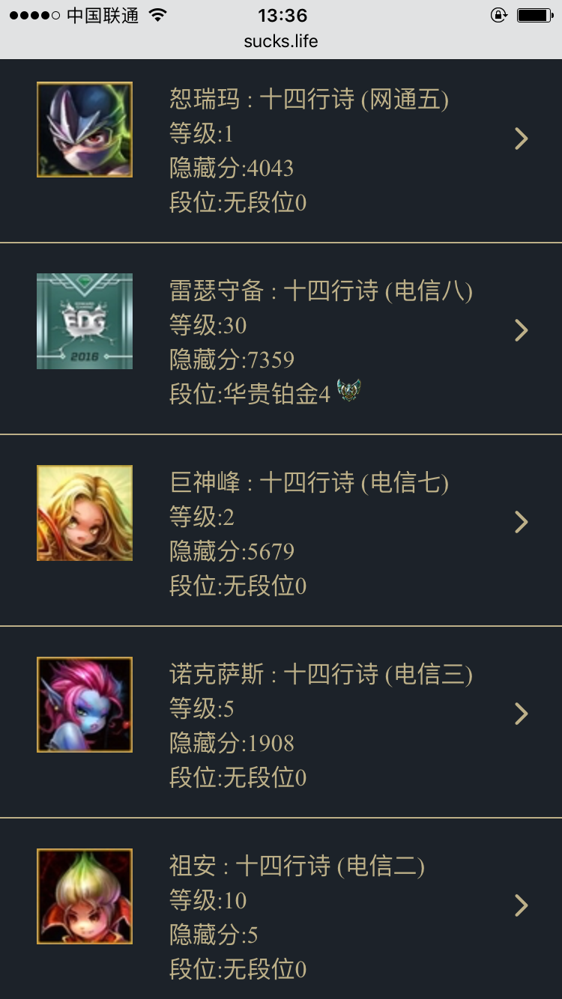
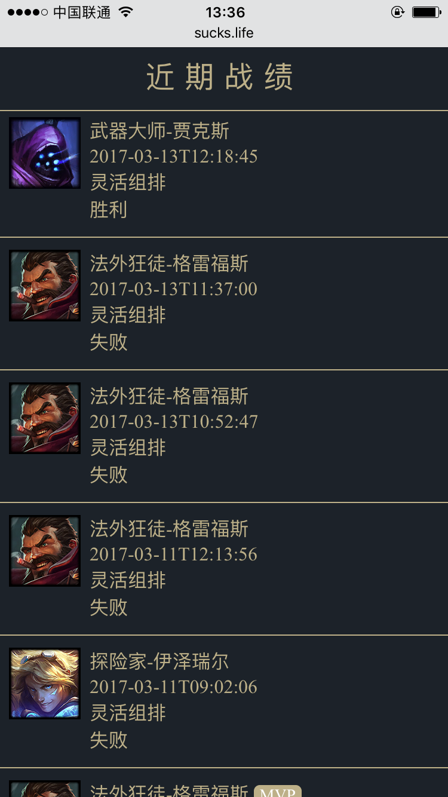
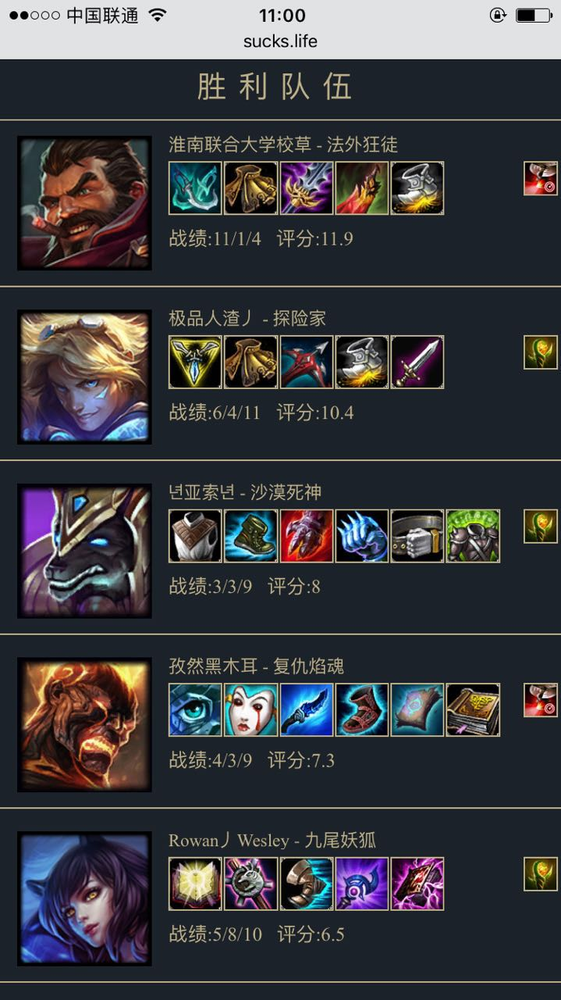

#react+python=>lol

## 简介
### 项目原地址([https://github.com/CurtisCBS/learn-react](https://github.com/CurtisCBS/learn-react))欢迎star ⭐️

### [👉查询我的战绩(节点1)](http://sucks.life) [查询我的战绩(节点2)](http://xurtis.com/lol/)

上周(17.3.9)看了两天新技术(react,python),顺手搞个项目看看,项目实现国服lol战绩查询

## 功能截图

### 搜索页面

## 使用

		git clone https://github.com/CurtisCBS/react-lol.git

		npm run dev

		visit localhost:8888

## 技术基础

### 前端
项目地址:[https://github.com/CurtisCBS/learn-react](https://github.com/CurtisCBS/learn-react)

* 	react
*  react-router
*  webpack
*  es6
*  axios

### 服务端
项目地址:[https://github.com/CurtisCBS/python_lol](https://github.com/CurtisCBS/python_lol)

*  python
*  flask
*  gunicorn
*  nginx

## 实现内容

* 召唤师信息查询及展示
* 召唤师近期战绩查询及展示
* 战绩具体信息展示

## 后续功能

* 排位信息展示

## 后续优化

* 战绩排行滚动分页加载
* 图片压缩
* chunk load
